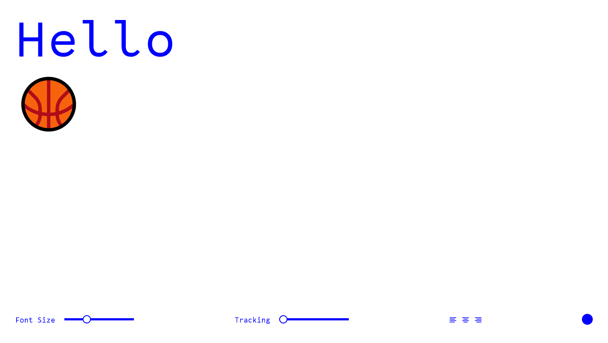

### Font Style Changer 🎹

A project from **week 3** of the FAC 22 pre-apprenticeship. 

💾 See full pre-apprenticeship repository [here](https://github.com/cemalokten/fac-pre-apprenticeship). 

The Font Style Changer uses CSS variables and JS to modify the size, tracking and justification of the fonts.

Inspired by the tutorial from Wes Bos JS30 (**Playing with CSS Variables**)

### 📚 What I learnt
- How to use CSS variables
- How to change those variables using JS `document.documentElement.style.setProperty('--property', 'value')`
- How to enable editing of text using `contenteditable="true"`
- How to create a simple light/dark theme switcher
- Toggle is much better than loads of `if` statments `document.documentElement.classList.toggle('dark');` FTW!
- How to retrieve input values from `input type="range"`
- How to style sliders using CSS `input[type="range"]`

### 🦺 Testing
- Works on latest version of Firefox, Chrome and Edge
- Does not work on mobile
- Further testing required

### ⏳ Future improvements
- [ ] More colour options
- [ ] Ability to change fonts
- [ ] Justify SVG icons look odd
- [ ] Mobile version

### 👀 Screenshots

